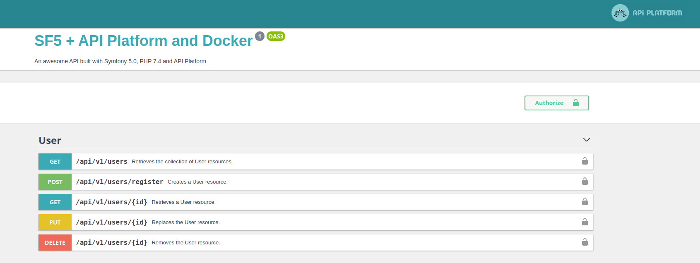

# Symfony 5 + API Platform + Docker boilerplate

## What is this?
This is a boilerplate project which includes `Symfony 5.0`, `API Platform` and a `Docker configuration`.

It contains all the features needed to start building an API:
- Authentication system with Json Web Tokens (JWT) (https://github.com/lexik/LexikJWTAuthenticationBundle)
- Security configuration using Symfony voters (https://symfony.com/doc/current/security/voters.html)
- Basic configuration for resources and serialization groups for API Platform
- Endpoints to manage users (register, get, update, delete)

- Mailer service with default configuration to use your google account to send emails `symfony/google-mailer` (https://symfony.com/doc/current/mailer.html). Feel free to add your custom provider!
- Fixtures for testing
- Unit test for the Register action
- Functional tests to cover the user endpoints use cases

IMPORTANT: to run functional tests access the database container and create a database called `database_test` or create your own configuration. `doctrine/doctrine-fixtures-bundle` and `liip/test-fixtures-bundle` are included.

## Folder structure
```
src
├───Api/
│   ├───Action/ <- Custom endpoints
│   ├───Listener/ <- API Platform listeners
├───DataFixtures/ <- Functional tests fake data
├───Entity/ <- Doctrine entities
├───Exception/ <- Domain exceptions
├───Migrations/ <- First migration (new migrations will be added here)
├───Repository/ <- Base repository and your repositories extending from it
├───Security/
│   ├───Authorization/ <- Place for your Voters
│   ├───Core/ <- UserProvider location
│   ├───Validator/ <- Your custom validators (see services.yml to check how they work
├───Service/ <- Your app services go here
├───Templating/ <- Reference to templates used by the MailerService
├───templates/ <- Twig templates for emails
├───tests/ <- Functional and unit tests
```

## Usage
- `make build` to build the docker environment
- `make run` to spin up containers
- `make prepare` to install dependencies and run migrations
- `make generate-ssh-keys` to generate JWT certificates
- Navigate to `http://localhost:500/api/v1/docs` to check the Open API v3 documentation
- `make restart` to stop and start containers
- `make ssh-be` to access the PHP container bash
- `make be-logs` to tail dev logs
- `make code-style` to run PHP-CS-FIXER on src and tests
- `make tests` to run the test suite

IMPORTANT: depending on if you are using MacOS or Linux check the configuration for Xdebug in your `docker-compose.yml` file and choose the correct one for your needs

## Stack:
- `NGINX 1.19` container
- `PHP 7.4 FPM` container
- `MySQL 8.0` container + `volume`

## Contributing
Feel free to clone, fork or PR this repo

## License
This bundle is under the MIT license.
For the whole copyright, see the [LICENSE](LICENSE) file distributed with this source code.
